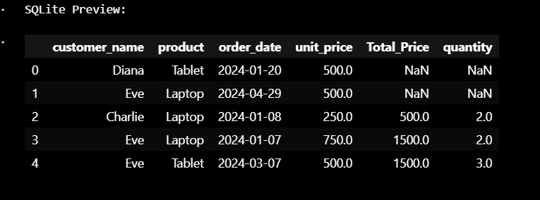

# ETL Pipeline for Sales Data Analysis

## 1. Project Overview
This project implements a complete ETL (Extract, Transform, Load) pipeline to process sales transaction data. It:
- Cleans raw sales data with missing values and inconsistencies
- Enriches data with calculated metrics (total price, customer tiers)
- Loads processed data into SQLite/Parquet formats
- Generates visualizations to reveal product performance trends

## 2. ETL Phases

# Phase 1: Extract (`etl_extract.ipynb`)
- Loads raw CSV files (`raw_data.csv`, `incremental_data.csv`)
- Performs initial data inspection with `.head()` and `.info()`
- Identifies data quality issues (missing values, duplicates)
- Saves raw copies to `data/` directory

# Phase 2: Transform (`etl_transform.ipynb`)
-  Key Transformations:
  1. **Cleaning**: Handles missing values (median imputation), removes duplicates
  2. **Structural**: Standardizes date formats, corrects data types
  3. **Enrichment**: Adds `Total_Price` (Quantity × Unit_Price)
  4. **Categorization**: Creates age bins and customer tiers (Bronze/Silver/Gold)
- Saves processed data to `transformed/` directory

# Phase 3: Load (`etl_load.ipynb`)
- Stores data in:
  - **SQLite** database (`loaded/etl_data.db`)
  - **Parquet** files (`loaded/*.parquet`)
- Includes validation queries/reads to verify data integrity

# 3. Tools Used
| Category       | Technologies               |
|----------------|----------------------------|
| Core           | Python 3, Jupyter Notebook |
| Data Processing| Pandas, NumPy              |
| Storage        | SQLite, Parquet (PyArrow)  |
| Visualization  | Matplotlib, Plotly (optional) |

# 4. How to Run the Project
1. Prerequisites:
   bash
   pip install pandas pyarrow sqlite3 matplotlib

Execution Order:

1. etl_extract.ipynb
2. etl_transform.ipynb
3. etl_load.ipynb

#screen
